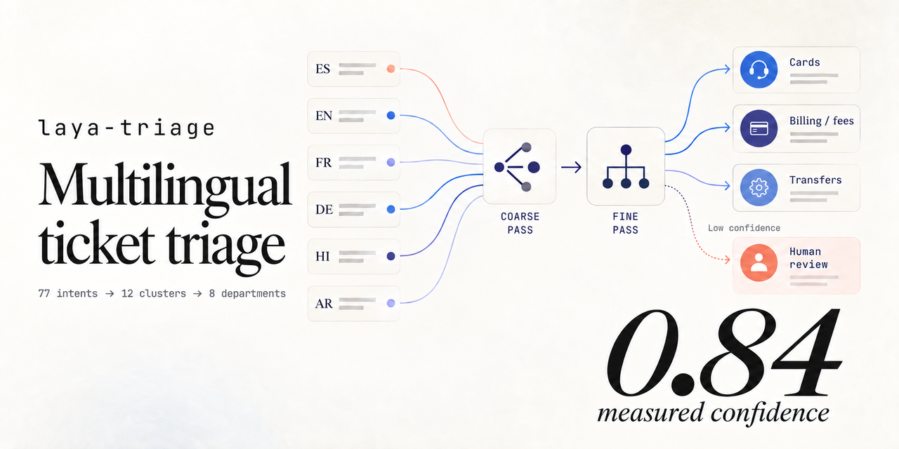

<p align="center">
  
</p>

<h1 align="center">laya-triage</h1>

<p align="center">
  Multilingual support-ticket triage on a local System 1 model.<br>
  Route intent, score customer signals, and escalate uncertainty to a human.
</p>

<p align="center">
  <a href="https://github.com/Gjusev/laya-triage/actions/workflows/ci.yml"></a>
  <a href="https://www.python.org/"></a>
  <a href="https://streamlit.io/"></a>
  <a href="https://www.kaggle.com/kernels/welcome?src=https://github.com/Gjusev/laya-triage/blob/main/finetune/laya_triage_banking77.ipynb"></a>
  <a href="LICENSE"></a>
</p>

<p align="center">
  <a href="#quickstart">Quickstart</a> ·
  <a href="#demo">Video</a> ·
  <a href="#measured-results">Results</a> ·
  <a href="https://www.kaggle.com/kernels/welcome?src=https://github.com/Gjusev/laya-triage/blob/main/finetune/laya_triage_banking77.ipynb">Kaggle notebook</a> ·
  <a href="docs/results/phase2.md">Full evaluation</a>
</p>

> [!NOTE]
> This project is in early development. The zero-shot pipeline, app, tests, evaluation artifacts, and the fine-tuning run are available; the fine-tuned checkpoint's Hugging Face release and the hosted Space are still pending.

## What it does

`laya-triage` turns a ticket in any supported language into an operational routing decision:

| Output | Meaning |
|---|---|
| `department`, `cluster`, `intent` | Hierarchical route across 77 BANKING77 intents, 12 clusters, and 8 departments |
| `urgency`, `frustration` | Expected scores from 0 to 3 |
| `churn_risk`, `refund_requested` | Probability-like yes/no outputs |
| `confidences` | Calibrated answer confidence for every decision |
| `escalate`, `escalation_reasons` | Explicit human handoff when routing confidence is below the threshold |

It is built on [laya](https://github.com/NandhaKishorM/laya), the Apache-2.0 System 1 decision engine. Inference runs locally after the checkpoints are downloaded on first use.

## Demo

The 20-second launch film shows the multilingual route, auxiliary signals, and confidence-based handoff:

https://github.com/Gjusev/laya-triage/raw/main/brag-output/brag.mp4

<p align="center">
  <a href="brag-output/brag.mp4"><strong>▶ Open the MP4 directly</strong></a>
  ·
  <a href="https://htmlpreview.github.io/?https://github.com/Gjusev/laya-triage/blob/main/docs/assets/how-it-works.html"><strong>Explore the animated pipeline</strong></a>
</p>

## Why hierarchical routing?

A flat choice over all 77 intents is where choice quality collapses. The pipeline narrows the decision in two stages:

```mermaid
flowchart LR
    T["Ticket<br/>any language"] --> R{"laya Router"}
    R -->|detected English| E["English checkpoint"]
    R -->|fallback / multilingual| M["Multilingual checkpoint"]
    E --> C["Coarse pass<br/>12 clusters + 4 signals"]
    M --> C
    C --> F["Fine pass<br/>3–10 candidate intents"]
    C --> S["Urgency · frustration<br/>churn · refund"]
    F --> D["8 departments"]
    C -. confidence below 0.84 .-> H["Human review"]
    F -. confidence below 0.84 .-> H
```

1. **Coarse pass** — selects one of 12 clusters and scores urgency, frustration, churn risk, and refund intent in the same forward pass.
2. **Fine pass** — chooses among only 3–10 intents inside the winning cluster.
3. **Escalation** — sends the ticket to a human if either routing decision falls below `min_confidence` (default: `0.84`) and records the reason.

Signal confidence is intentionally not used for escalation: score-type questions have structurally lower confidence and would hand off almost every ticket. The policy gates only `cluster` and `intent`.

## Measured results

All headline numbers come from committed artifacts in [`evals/results/`](evals/results) and can be reproduced with `python -m evals.run_all`.

| Measurement | Result | Evaluation set |
|---|---:|---|
| Fine-tuned hierarchical intent accuracy | **90.5%** (macro-F1 0.848) | 200 BANKING77 test tickets, seed 13 |
| Zero-shot hierarchical intent accuracy | 51.0% | Same sample |
| Flat 77-way intent accuracy | 36.5% | Same sample |
| Improvement over flat routing (zero-shot) | **+14.5 pp** | Same sample |
| Accuracy at the `0.84` threshold (zero-shot) | **75.2%** | 60.5% auto-handled coverage |
| Coarse-cluster accuracy | 96.0% fine-tuned / 68.0% zero-shot | Same sample |
| Urgency / frustration MAE | 0.81 / 1.07 | Hand-labeled 200-ticket set |

At roughly 60% coverage, the measured escalation curve reaches about 75% intent accuracy. This operating point is based on 200 tickets—use it as an evidence-backed starting point, not a universal production guarantee. See the [full Phase 2 report](docs/results/phase2.md) for macro-F1, the complete coverage/accuracy curve, multilingual breakdowns, annotation agreement, and timing.

## Quickstart

Requires Python 3.10+ and [uv](https://docs.astral.sh/uv/) (or a regular virtual environment with `pip`).

```bash
git clone https://github.com/Gjusev/laya-triage.git
cd laya-triage

uv venv
uv pip install -e ".[app]"
```

Triage one ticket:

```python
from laya_triage import TriagePipeline, build_router

pipeline = TriagePipeline(build_router(), min_confidence=0.84)
result = pipeline.triage("me cobraron dos veces, reembolsen o cancelo")

print(result.department, result.cluster, result.intent)
print(result.urgency, result.frustration)
print(result.churn_risk, result.refund_requested)
print(result.escalate, result.escalation_reasons)
```

Useful options:

```python
# Skip automatic language detection when the language is known.
result = pipeline.triage(ticket, lang="es")

# Score every window of a long ticket.
result = pipeline.triage(long_ticket, long=True)

# Share forward passes across many tickets.
results = pipeline.triage_batch(tickets, batch_size=16)
```

The router defaults to the multilingual checkpoint when language detection is undecided. Detection-confident English still uses the English checkpoint; this matters for short, unaccented Latin text that may otherwise be ambiguous.

## Streamlit app

Launch the local UI:

```bash
streamlit run app.py
```

The app includes:

- **Single ticket** — triage text in English, Spanish, French, German, Hindi, or Arabic, with an optional language hint.
- **CSV batch** — upload a file with a `text` column, run batched inference, and download the enriched results.
- **Metrics** — inspect the committed BANKING77, MASSIVE, and hand-labeled evaluation artifacts.

Hugging Face Space scaffolding and deployment notes live in [`space/`](space). The public Space URL will be added after deployment.

## Fine-tune on Kaggle

The notebook adapts laya's official 2×T4 training workflow for the two routing decisions. It trains on 10,003 BANKING77 tickets (two sequences per ticket), evaluates against the committed zero-shot baseline, re-checks auxiliary-signal MAE, and builds a model card from the run's own results.

<p align="center">
  <a href="https://www.kaggle.com/kernels/welcome?src=https://github.com/Gjusev/laya-triage/blob/main/finetune/laya_triage_banking77.ipynb">
    
  </a>
</p>

Kaggle settings:

- Accelerator: **GPU T4 ×2**
- Internet: **On**
- Optional publishing secret: `HF_TOKEN`
- Output: `/kaggle/working/laya_triage_banking77`

You can also [inspect or download the notebook directly](finetune/laya_triage_banking77.ipynb). The committed run trained on 2×T4 and measured **90.5%** hierarchical intent accuracy on the seed-13 test sample (vs 51.0% zero-shot), with the signal heads untouched (urgency MAE 0.70 on the English hand-labeled subset, vs 0.81 zero-shot) and a hold-out-fitted choice temperature of 3.825. The full artifact is [`evals/results/banking77_finetuned.json`](evals/results/banking77_finetuned.json).

## Intent map

<details>
<summary><strong>Show the 12 clusters and 8 destination departments</strong></summary>

| Cluster | Intents | Department |
|---|---:|---|
| `card_ordering_and_delivery` | 6 | `cards` |
| `card_types_and_linking` | 9 | `cards` |
| `card_and_pin_malfunctions` | 6 | `cards` |
| `card_payment_problems` | 6 | `payments_cash` |
| `cash_and_atm` | 6 | `payments_cash` |
| `transfers_and_beneficiaries` | 9 | `transfers` |
| `top_ups_and_balance_updates` | 10 | `topups_deposits` |
| `fees_charges_and_refunds` | 8 | `billing_fees` |
| `exchange_rates` | 4 | `billing_fees` |
| `identity_and_account_admin` | 7 | `account_access` |
| `lost_stolen_compromised` | 3 | `fraud_security` |
| `eligibility_and_coverage` | 3 | `general_service` |

</details>

BANKING77 is a neobank dataset and contains no loan or credit intents, so a loans department would be empty by construction. Intent labels retain the dataset's canonical spellings, including `Refund_not_showing_up` and `reverted_card_payment?`.

## Reproduce the evaluation

```bash
uv pip install -e ".[dev]"
uv pip install datasets

pytest -q
python -m evals.run_all --limit 200
```

The regular test suite is deterministic and does not download checkpoints. Real-checkpoint smoke tests are opt-in:

```bash
pytest -m slow
```

| Resource | Contents |
|---|---|
| [`docs/results/phase2.md`](docs/results/phase2.md) | Full tables, caveats, and methodology |
| [`evals/results/`](evals/results) | Machine-readable evaluation artifacts |
| [`data/annotation_guide.md`](data/annotation_guide.md) | Label definitions, provenance, and adjudication process |
| [`data/hand_labeled_200.jsonl`](data/hand_labeled_200.jsonl) | Six-language signal evaluation set |
| [`docs/assets/how-it-works.html`](docs/assets/how-it-works.html) | Standalone animated architecture explainer |
| [`brag-output/`](brag-output) | Launch video, poster, share copy, and composition source |

## Known limitations

- The hierarchy is domain-specific: out-of-domain requests are mapped to the nearest banking concept when confidence is high enough. On an eight-ticket IT-operations smoke set, seven escalated at `0.84`; the remaining SSO lockout mapped to `unable_to_verify_identity`.
- Multilingual in-domain coarse accuracy is lower than English on the small per-language evaluation, especially for Arabic and German. The multilingual fine-tune remains future work.
- The multilingual checkpoint ships an invalid temperature for choices with 11+ options; laya clamps it. This affects calibration on the 12-option non-English coarse stage and is why recalibration is on the roadmap.
- The published latency numbers were measured on the development CPU (182.7 s flat / 577.4 s hierarchical for 200 tickets), not a deployment target; the fine-tuned checkpoint's 16.1 s sample time is a Kaggle T4 measurement. p50/p95 latency and cost per 1,000 tickets remain to be benchmarked.
- The GPT-4o-mini baseline has not been run yet.

## Roadmap

- [x] Coarse-to-fine BANKING77 routing
- [x] Urgency, frustration, churn-risk, and refund signals
- [x] Measured confidence-based escalation curve
- [x] Multilingual and hand-labeled evaluations
- [x] Streamlit app and Kaggle-ready fine-tuning notebook
- [x] Run the fine-tune on Kaggle 2×T4 and publish the measured artifact
- [ ] Publish the fine-tuned checkpoint on Hugging Face
- [ ] Deploy and link the Hugging Face Space
- [ ] Publish deployment-target latency and cost benchmarks
- [ ] Run the GPT-4o-mini comparison

## License

Released under the [Apache License 2.0](LICENSE).
